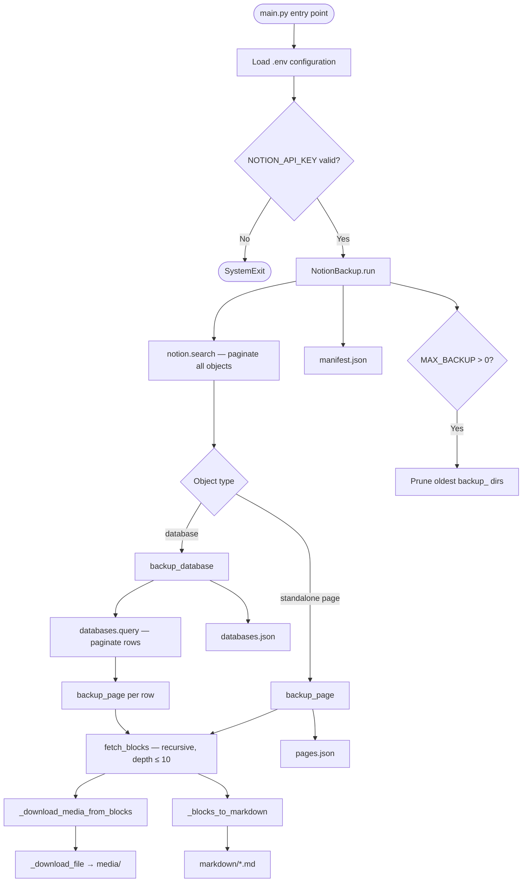

> **⚠️ ARCHIVED PROJECT**  
> This project is archived and now part of my [automation-toolbox](https://github.com/sadmanhsakib/automation-toolbox) repository.

# notion-backup

A self-hosted Python utility that performs complete, offline-portable backups of a Notion workspace via the official Notion REST API. The tool serialises every page and database the configured integration can access into two complementary output formats — structured JSON (preserving full API fidelity) and rendered Markdown (human-readable, portable) — while eagerly downloading all binary media assets before their Notion-issued signed URLs expire. It is intended for individuals and small teams who require a durable, platform-independent archive of their Notion data without reliance on Notion's proprietary export pipeline.

---

## Architecture Overview



### Key Components

| Component | Location | Responsibility |
|---|---|---|
| `NotionBackup` | `main.py:39` | Orchestration class; owns all API interaction, serialisation, and output writing |
| `paginate()` | `main.py:431` | Transparently exhausts cursor-based Notion API pagination |
| `retry_with_backoff()` | `main.py:391` | Handles HTTP 429 responses with exponential backoff and jitter, honouring `Retry-After` |
| `fetch_blocks()` | `main.py:45` | Recursively resolves a page's block tree up to a configurable depth ceiling |
| `_download_file()` | `main.py:80` | Downloads binary assets using `requests` (which correctly follows HTTPS redirects and preserves authentication headers) |
| `_blocks_to_markdown()` | `main.py:153` | Converts the in-memory block tree to Markdown text |
| `safe_title()` | `main.py:447` | Normalises title extraction across pages and databases, which expose the field differently |
| `main()` | `main.py:373` | Entry point; instantiates the client and invokes rotation after the backup completes |

### Output Structure

Each invocation produces a timestamped directory under `BACKUP_OUTPUT_DIR`:

```
backup_YYYYMMDD_HHMMSS/
├── databases.json       # All database schemas and their row content (full API payload)
├── pages.json           # All standalone pages (not rows of any database)
├── manifest.json        # Run summary: counts, duration, timestamp
├── media/               # Binary assets (images, videos, audio, PDFs, files)
│   └── <type>_<block_id>.<ext>
└── markdown/            # One .md file per page or database row
    └── <sanitised_title>_<uid[:8]>.md
```

---

## Core Design Decisions

### 1. Dual-format output: JSON as source of truth, Markdown as human layer

Every page and database row is stored twice. The JSON files preserve the complete Notion API response — including all metadata, property values, and block payload — providing a lossless archive from which the data can be re-processed. The Markdown files are derived, human-readable renderings of block content for immediate readability without tooling. This separation means the archive can survive future changes to the Markdown renderer without any data loss.

### 2. Eager media download during the run

Notion-hosted binary assets (images, videos, audio, PDFs, and generic files) are served via time-limited signed S3 URLs that expire approximately one hour after issuance. The tool therefore downloads all media synchronously during the same run in which the API response is fetched, rather than deferring downloads. The `local_path` field is injected into each media block *in-place* before `_blocks_to_markdown` is called, allowing the Markdown output to reference local relative paths instead of the now-expired remote URLs.

### 3. Resilient API interaction: pagination exhaustion and rate-limit backoff

The Notion API returns results in pages of up to 100 items. `paginate()` wraps every list or query call, collecting all cursor pages transparently before returning. `retry_with_backoff()` intercepts HTTP 429 responses with a two-tier strategy: it first honours the `Retry-After` header if present, and otherwise applies exponential backoff with full jitter (`random(0, min(64, 1 × 2ⁿ))`) across up to five retries. This combination makes the tool robust against both large workspaces and transient API throttling.

### 4. Database row deduplication

When Notion's `search` endpoint returns results, it includes both database objects and their constituent page-rows as top-level entries. Without deduplication, each row would be backed up twice — once through `backup_database` and again through the standalone page pass. The orchestrator in `run()` builds a set of all row IDs captured during database processing and excludes them from the standalone page pass, ensuring each content item is archived exactly once.

---

## Getting Started

### Prerequisites

- Python ≥ 3.12
- [`uv`](https://github.com/astral-sh/uv) (recommended) or `pip`
- A Notion integration with read access to the target workspace

### 1. Create a Notion Integration

1. Navigate to [https://www.notion.so/profile/integrations](https://www.notion.so/profile/integrations) and create a new internal integration.
2. Copy the generated API key (prefixed `ntn_` or `secret_`).
3. For each Notion page or database to be backed up, open it in Notion, go to **··· → Connections**, and connect the integration. The tool can only access content explicitly shared with it.

> [!IMPORTANT]
> If a page returns no blocks despite having visible content, the integration has not been granted access to that page. The tool will emit a warning log message pointing to this exact step.

### 2. Install Dependencies

```bash
# Using uv (recommended — reads uv.lock for reproducible installs)
uv sync

# Using pip
pip install -r requirements.txt
# or, if using pyproject.toml directly:
pip install .
```

### 3. Configure Environment

Copy `example.env` to `.env` and populate the values:

```bash
cp example.env .env
```

```dotenv
NOTION_API_KEY=ntn_xxxxxxxxxxxxxxxxxxxxxxxxxxxx
BACKUP_OUTPUT_DIR=/path/to/backup/destination
MAX_BACKUP=7
```

### 4. Run

```bash
# Single backup run
python main.py

# Verify the output directory for the timestamped backup folder
ls $BACKUP_OUTPUT_DIR
```

Log output is written to `stdout` in the format `YYYY-MM-DD HH:MM:SS  LEVEL    message`.

---

## Configuration Reference

All configuration is read from the `.env` file (or from the process environment) at startup via `python-dotenv`. There are no command-line flags in `main.py`.

| Variable | Required | Default | Description |
|---|---|---|---|
| `NOTION_API_KEY` | **Yes** | — | The integration API key from Notion. Accepted formats: `ntn_…` (newer) or `secret_…` (legacy). |
| `BACKUP_OUTPUT_DIR` | **Yes** | — | Absolute or relative path to the directory under which timestamped `backup_YYYYMMDD_HHMMSS/` subdirectories are created. The directory and all parents are created automatically. |
| `MAX_BACKUP` | No | `0` | Maximum number of backup directories to retain. When the count exceeds this value after a successful run, the oldest directories (sorted lexicographically by name, which is equivalent to chronological order given the timestamp format) are deleted via `shutil.rmtree`. A value of `0` disables rotation entirely. |

> [!CAUTION]
> The `.env` file contains your Notion API key and is listed in `.gitignore`. It must never be committed to version control. The `example.env` file provided in the repository contains only empty placeholder values and is safe to commit.

---

## Known Limitations and Constraints

**Integration scope is opt-in per page.** The Notion API does not grant workspace-wide access by default. Each top-level page and database must be individually connected to the integration, and pages nested under unshared parents will not appear in `notion.search` results and will therefore be silently omitted from the backup. The warning logged for empty block responses is the only signal available.

**Block depth is capped at 10 levels.** `fetch_blocks()` enforces a maximum recursion depth of 10 to prevent infinite loops or excessive API consumption on pathologically nested content. Block trees deeper than this limit will be truncated; a warning is emitted at the point of truncation.

**Markdown rendering is lossy.** The Markdown renderer covers the most common block types (paragraphs, headings, lists, to-do items, quotes, callouts, code blocks, tables, dividers, toggles, and media). Block types outside this set — including Notion's synced blocks, embedded databases, equations, breadcrumbs, link previews, and column layouts — are silently skipped. The JSON output is unaffected and remains complete.

**Rich text formatting is stripped.** The `rt()` helper inside `_blocks_to_markdown` extracts only `plain_text` from Notion's `rich_text` arrays, discarding inline annotations such as bold, italic, strikethrough, underline, inline code, and hyperlinks. Formatted text therefore appears as plain prose in the Markdown output.

**External media is not downloaded.** Assets referenced by blocks with `"type": "external"` have their original remote URL written into the Markdown but are not fetched. Only Notion-hosted assets (those with `"type": "file"`) are downloaded.

**No incremental or differential backups.** Each run performs a full traversal of the workspace. There is no mechanism to detect changes since the last backup or to skip pages that have not been modified.

**No scheduling in `main.py`.** Although the `schedule` library is declared as a dependency in `pyproject.toml`, the production entry point (`main.py`) performs a single backup and exits. Recurring execution must be configured externally via the operating system's task scheduler (e.g., Windows Task Scheduler or `cron`).